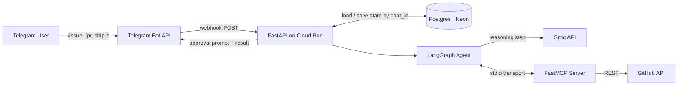
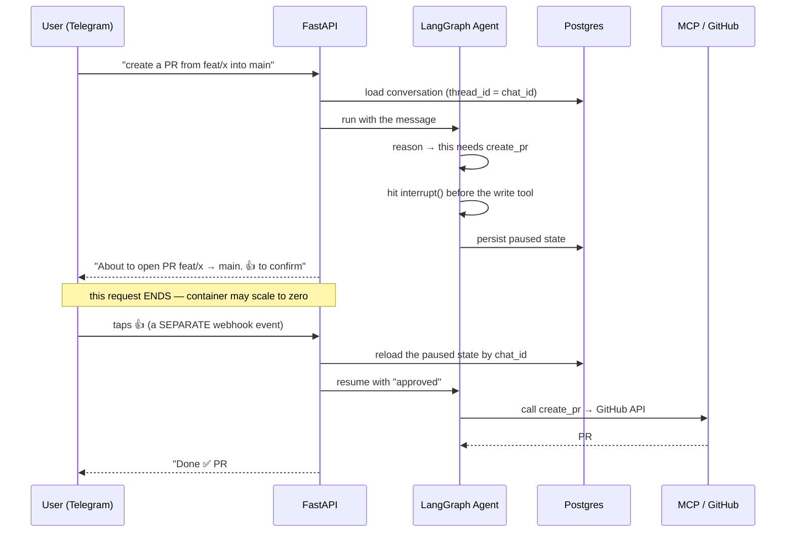

# GitPilot — Telegram → GitHub Ops Agent

> Working name; rename freely.

## One-line description

A Telegram-native AI agent that turns plain-English chat commands into real GitHub actions (issues, PRs, releases), pausing for human approval before anything irreversible.

## Highlights

1. **Durable human-in-the-loop.** The agent pauses mid-task on one webhook event and resumes on a *separate* approval event — genuine `interrupt()`/resume backed by persisted state, not an in-memory toy. This is the pattern that separates a real agent platform from a script.
2. **Stateless service, externalized state.** All conversation state lives in Postgres keyed by chat ID, so disposable containers can scale to zero and multiple simultaneous commands stay correct — safe concurrency *without* building a load balancer.
3. **You write the MCP.** Thin FastMCP tools wrap the GitHub REST API — real side effects, not retrieval — teaching the full agent + MCP + serverless-deploy loop end to end.

## Tech stack

| Layer | Choice | Why |
|---|---|---|
| Language | Python 3.11+ | ecosystem fit |
| Agent orchestration | **LangGraph** | `StateGraph`, `interrupt()`, checkpointer |
| LLM (brain) | **Groq API** (free tier, OpenAI-compatible) | no GPU, fast, free (30 req/min) |
| Tools protocol | **FastMCP** + `langchain-mcp-adapters` | write your own MCP server; load tools into the graph |
| Backend | **FastAPI** | async webhook endpoint |
| Messaging | **Telegram Bot API** (webhook + inline keyboards) | no signature crypto, no 3s ACK deadline → plays nice with scale-to-zero |
| External API | **GitHub REST API** (`httpx` or PyGithub) | the real actions; free, 5,000 req/hr authenticated |
| State store | **Postgres** (Neon or Supabase free tier) | durable LangGraph checkpointer |
| Container | **Docker** | portability |
| Hosting | **Google Cloud Run** | serverless, autoscaling, scale-to-zero, always-free tier |
| Secrets | Cloud Run env / Secret Manager | keep tokens out of code |
| Observability *(later)* | LangSmith | trace every agent step |
| CI/CD *(later)* | GitHub Actions → Cloud Run | auto build + redeploy on push |

## Architecture



**Reading it:** FastAPI is the only public surface. The agent lives inside it; Groq is just the reasoning call; the FastMCP server is a stdio subprocess the agent talks to; Postgres holds all durable state so the container itself stays disposable. Cloud Run is your load balancer — it autoscales instances and spreads requests for you.

## Project structure

```
gitpilot/
├── app/
│   ├── main.py          # FastAPI app + Telegram webhook endpoint (fast ACK)
│   ├── telegram.py      # send messages, inline keyboards (👍/👎), parse updates
│   ├── agent.py         # LangGraph graph: nodes, interrupt() gate, checkpointer wiring
│   ├── security.py      # secret-token check, user allowlist, update_id dedup
│   └── config.py        # env-var settings (tokens, DB URL, model name)
├── mcp_server/
│   ├── server.py        # FastMCP server: registers tools, runs over stdio
│   └── github_tools.py  # create_issue, create_pr, get_ci_status, create_release
├── Dockerfile
├── requirements.txt
├── .env.example         # names only, never real secrets
└── README.md
```

Keep the GitHub token, Telegram token, Groq key, and Postgres URL in env vars only — never committed.

## Project flow (the `/pr` or `/issue` command)



The single hardest, most valuable idea is the gap between the two `U->>F` arrows: the approval is a **different HTTP request** than the one that paused. Gluing "two separate events, one continuous conversation" together through durable state *is* the production-agent lesson.

## Iteration plan

**Guiding principles (this is what keeps it fast):**
- **Run it end-to-end at the end of every phase.** Never build two layers before testing one.
- **Stay local through Phase 3; deploy only in Phase 4.** Use `ngrok` to expose your local FastAPI so Telegram can reach it. This keeps a tight feedback loop while you learn the hard agent parts, and quarantines all cloud friction into one phase.
- **MVP = Phases 0–4.** Everything after is a stretch goal, not a blocker.

| Phase | Goal | You build | You learn | Est. |
|---|---|---|---|---|
| **0 · Echo** | Prove the pipe works | FastAPI webhook that receives a Telegram message and echoes it back (via ngrok) | Telegram webhook mechanics, FastAPI, ngrok tunneling | 1–2 h |
| **1 · Agent + 1 tool (no gate)** | An agent that takes a real action | FastMCP server with `create_issue`; LangGraph agent on Groq that decides to call it; issue actually gets created | FastMCP tool authoring, `langchain-mcp-adapters`, ReAct loop, Groq wiring | 3–4 h |
| **2 · Durable state** | Survive a restart | Add `PostgresSaver` checkpointer (Neon), `thread_id = chat_id`; kill the app mid-convo and prove it resumes | Checkpointers, externalized state, why the container is disposable | 1–2 h |
| **3 · Human-in-the-loop** | The real spine | `interrupt()` before the write tool; send a 👍/👎 inline keyboard; approval arrives as a separate update → resume the graph | **interrupt/resume across two events — the hard 30%** | 2–3 h |
| **4 · Harden + deploy** | Live on the internet | Secret-token verify + user allowlist + `update_id` dedup + fast ACK; Dockerfile; deploy to Cloud Run; point webhook at the Cloud Run URL; secrets in env | Webhook security, serverless deploy, stateless concurrency | 3–4 h |
| **5 · Stretch** | Make it a platform | `ship it` flow (`get_ci_status` → draft notes → `create_release` behind the gate); LangSmith tracing; GitHub Actions auto-deploy | Multi-tool planning, observability, CI/CD | open-ended |

**MVP total: ~10–15 focused hours.** At the end of Phase 4 you have an agent that takes real, approved GitHub actions and is deployed serverless with durable state — the whole learning target, shipped.

### Definition of done per phase
- **0:** you text the bot, it echoes.
- **1:** you text "open an issue about the login bug," an issue appears on your practice repo.
- **2:** restart the process mid-conversation; it picks up where it left off.
- **3:** the bot asks before creating, and only acts after you tap 👍.
- **4:** all of the above works from the public Cloud Run URL, secrets are in env, and a random POST without the secret token is rejected.

### Safety rails baked in from Phase 1
- Do everything on a **throwaway practice repo**.
- Auth with a **fine-grained PAT scoped to that one repo** (Issues: R/W, Contents: R/W, Pull requests: R/W).
- Blast radius = one sandbox repo, even if the agent misbehaves.